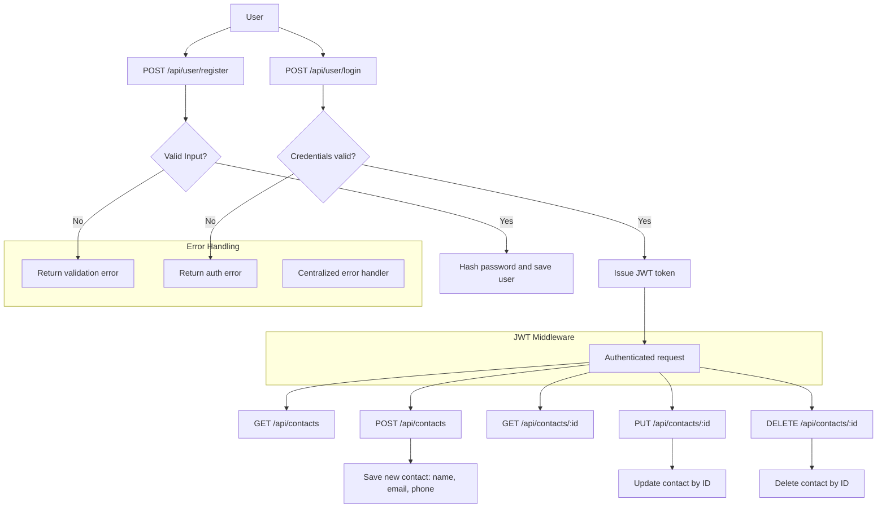

# 📇 Contact Management System

A simple and secure RESTful API built with **Node.js**, **Express**, and **MongoDB (Mongoose)** for managing user contacts. The system provides user authentication via **JWT**, and supports full **CRUD** operations for contacts. All contact routes are protected and accessible only to authenticated users.

---

## ✨ Features

- 🔐 **User Registration & Login**  
  Secure signup/login with hashed passwords (`bcrypt`) and JWT-based auth.

- 🔑 **JWT Authentication**  
  All contact routes require a valid token via the `Authorization` header.

- 📒 **Contact CRUD Operations**  
  Authenticated users can **Create**, **Read**, **Update**, and **Delete** their own contacts.

- ⚠️ **Centralized Error Handling**  
  Custom error middleware ensures consistent API responses.

---

## 🧭 Flow Diagram



## 🗂️ Project Structure

```
/config
  db.js                        # MongoDB connection logic

/controller
  contactController.js         # Handles contact operations
  userController.js            # Handles user registration/login

/middleware
  errorHandler.js              # Centralized error handler
  validationCheckHandler.js    # JWT validation middleware

/models
  contactsModel.js             # Mongoose schema for contacts
  userModel.js                 # Mongoose schema for users

/routes
  contactsRoute.js             # Contact-related routes
  userRoute.js                 # User registration/login routes

index.js                       # Entry point
Dockerfile                     # Docker configuration
```

---

## 📬 API Endpoints

### 👤 User Routes

**POST /api/user/register** – Register a new user  
**Body:**

```json
{
  "username": "John",
  "email": "john@example.com",
  "password": "123456"
}
```

**POST /api/user/login** – Login and receive JWT token  
**Body:**

```json
{
  "email": "john@example.com",
  "password": "123456"
}
```

**GET /api/user/current** – Get current logged-in user info (🔐 Requires JWT)

---

### 📇 Contact Routes (🔐 Require JWT)

**Authorization header:**

```
Authorization: Bearer <token>
```

**GET /api/contacts** – Get all contacts for the user  
**POST /api/contacts** – Create a new contact  
**Body:**

```json
{
  "name": "Jane",
  "email": "jane@example.com",
  "phone": "9876543210"
}
```

**GET /api/contacts/:id** – Get a specific contact  
**PUT /api/contacts/:id** – Update a contact  
**DELETE /api/contacts/:id** – Delete a contact

---

## 🚀 Getting Started

### 🧰 Prerequisites

- Node.js v18+
- MongoDB Atlas or local instance
- Docker (optional)

---

### 🔐 Environment Variables

Create a `.env` file in the root directory with:

```env
PORT=5000
MONGO_URL=mongodb+srv://<username>:<password>@cluster.mongodb.net/<dbname>
ACCESS_TOKEN_SECRET=your_jwt_secret
```

---

### 🧪 Running the Project

#### Without Docker

```bash
npm install
npm start
```

#### With Docker

```bash
docker build -t contact-management-system .
docker run -p 3000:3000 --env-file .env contact-management-system
```

> 🌐 Access at: `http://localhost:3000/api/user/current`

---

## 🐳 Docker Hub Image

Pull the image directly:

```bash
docker pull sanketpilane/contact-management-app:latest
```

---

## 📌 Notes

- All contact data is scoped to the logged-in user only
- JWTs expire after **15 minutes**
- Passwords are securely hashed with bcrypt
- Built with modular structure for scalability

---

## 🤝 Contributing

Feel free to fork this repo and submit PRs to improve features or fix bugs. Feedback and suggestions are welcome!

---

## 📄 License

This project is licensed under the **MIT License**
